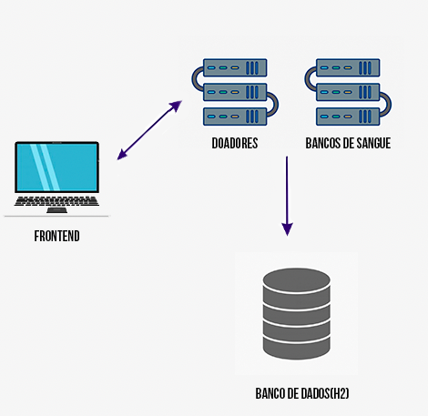

<h1 align="center">Banco de Sangue - Webservices & Restful Technologies </h1>

 

   <a href="#-tecnologias">Tecnologias</a>&nbsp;&nbsp;&nbsp;|&nbsp;&nbsp;&nbsp;
   <a href="#-projeto">Projeto</a>&nbsp;&nbsp;&nbsp;|&nbsp;&nbsp;&nbsp;
   <a href="#-topologia">Topologia</a>&nbsp;&nbsp;&nbsp;|&nbsp;&nbsp;&nbsp;
   <a href="#-executar">Como executar ?</a>&nbsp;&nbsp;&nbsp;&nbsp;&nbsp;&nbsp;
 

## Topologia

 

  

 ## :rocket: Tecnologias

 Esse projeto foi desenvolvido utilizando Java, Spring e React.js

 ## 💻 Projeto

 Projeto referente a disciplina de Webservices & Restful Technologies, do MBA da [FIAP](https://www.fiap.com.br/mba/mba-em-full-stack-developer-microservices-cloud-e-iot/). Foi desenvolvida uma solução para o cadastramento de doadores de sangue em um banco, criando assim uma API com os dados destes doadores. Você pode ver um exemplo em vídeo do funcionamento dessas features nesse [link](https://vimeo.com/469054093 )

 ## Como executar ?

 - Baixar o projeto: `$ git clone https://github.com/DougGoncalves/webservicesRestfulTech`

 - Importar o projeto na IDE de sua escolha

 - Acessar a pasta **api** , o arquivo **build.gradle** contém tudo o que é necessário para a importação do projeto. Acessar a classe **ApiApplication.java** e execute.

 - Acessar a pasta **frontend**, realizar o import dos módulos necessários para a execução do React.js com o comando `npm install` e para rodar aplicação `npm start`, a aplicação irá abrir no browser.

 ---
<h4 align="center">
   Code and coffee ☕
</h4>